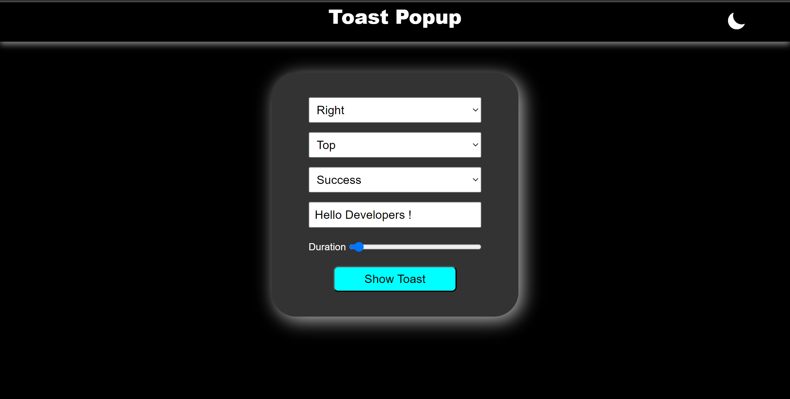

# popup-msg



A simple popup message mini project created with HTML, CSS, and JavaScript.

## Table of Contents
- [Demo](#demo)
- [Description](#description)
- [Features](#features)
- [License](#license)

## Demo
You can also try the live demo [here](#your-live-demo-url).

## Description
This mini project demonstrates how to create a popup message using web technologies like HTML, CSS, and JavaScript. It provides a simple and customizable popup that you can integrate into your web projects.

## Features
- **Customizable**: Easily customize the popup message's content and appearance to fit your project's design.
- **Responsive**: The popup is designed to work on various screen sizes, making it suitable for both desktop and mobile devices.
- **Lightweight**: The code is optimized for performance and minimal resource usage.


   ```bash
   git clone https://github.com/ajeetraj11/popup-msg.git
